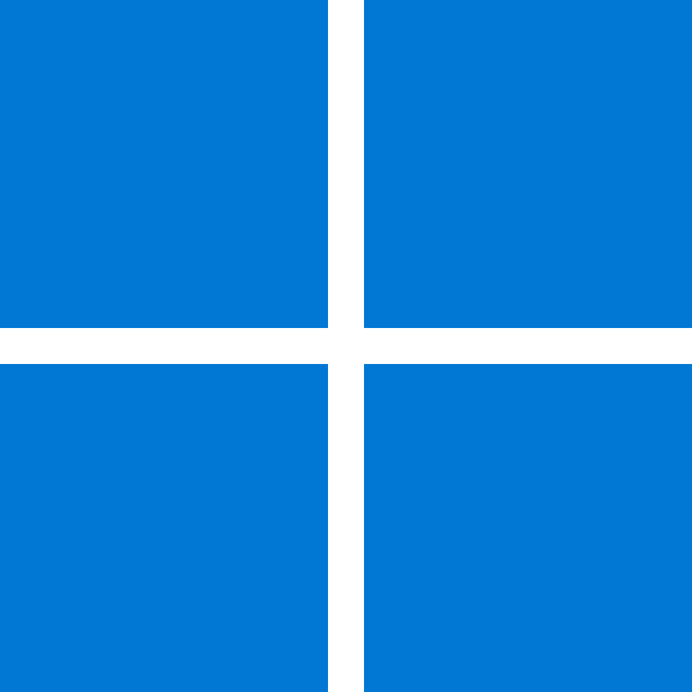
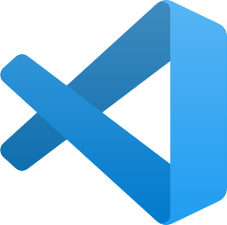

# thqnhz.github.io

Just a random website

## Assets

Fonts

Fonts used in this project: [Fira Code](<https://fonts.google.com/specimen/Fira+Code>), [JetBrains Mono](<https://fonts.google.com/specimen/JetBrains+Mono>)

The fonts are licensed under `SIL Open Font License`.

Desktop Wallpaper

[Pixiv](<https://www.pixiv.net/en/artworks/119791514>) | Author: [Ekita玄](<https://www.pixiv.net/en/users/14793912>)

Logos

Most of them are taken from [Logopedia](https://logos.fandom.com/). And are licensed under `CC-BY-SA`.

## License

Apart from the assets used, the ***code*** is licensed under MIT. See [`LICENSE`](LICENSE).
